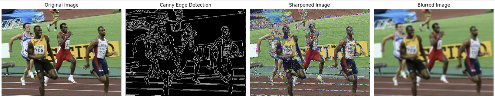

# Advanced Image Processing Techniques

 
* Image Source: [Wikipedia](https://en.wikipedia.org/wiki/Usain_Bolt)
 
This repository is a comprehensive selection of sections in Jupyter notebook demonstrating various image processing techniques. Each section is designed to offer practical insights into different methods, making it suitable for educational purposes and real-world applications alike.

## Techniques Covered

- **K-Means Clustering for Image Segmentation**: Explore how k-means clustering can be used to segment images by color.
- **Otsu's Method**: An automatic thresholding technique crucial for separating foreground from background in grayscale images.
- **Image Filtering using Convolution**:
  - *Canny Edge Detection*: Detect edges in images effectively.
  - *Image Sharpening*: Enhance the details in images.
  - *Image Blurring*: Apply smoothing techniques to reduce noise and details.
- **Noise Addition and Denoising**: Learn how to simulate noise in images and subsequently remove it to clean up images.

## Figures to Include

1. **Before and After Segmentation**: Show images before and after applying k-means clustering for color segmentation.
2. **Otsu's Thresholding Results**: Display a grayscale image before and after applying Otsu's thresholding.
3. **Filtering Effects**:
   - A combined figure showing the effects of edge detection, sharpening, and blurring on the same image.
4. **Noise Management**: Images before adding noise, after adding noise, and after denoising.

## Usage

The notebook in this repository is self-contained and includes comments to guide you through the processes described. You can run the notebook in an environment that supports Jupyter, such as Anaconda or directly through JupyterLab.
